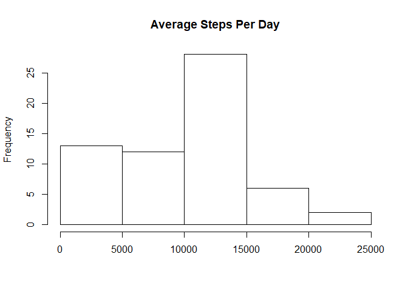
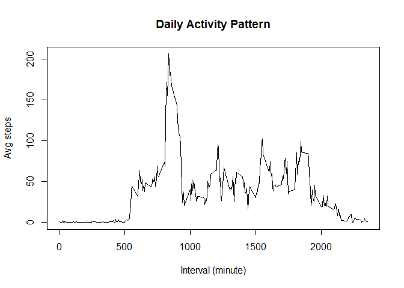
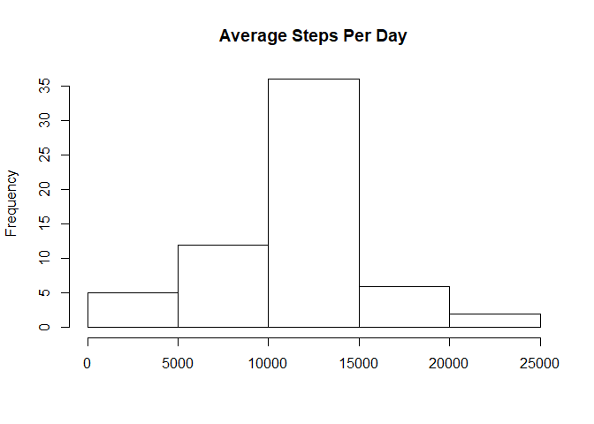
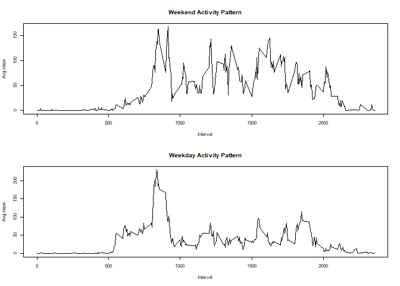

## Loading and preprocessing the data

```r
inputFile <- paste0(getwd(),"/activity/activity.csv")  
inputData <- read.csv(inputFile, stringsAsFactors = FALSE)
inputData$date <- as.Date(inputData$date)
inputData$interval <- as.numeric(inputData$interval) #convert types
inputData$steps <- as.numeric(inputData$steps)
```

## What is mean total number of steps taken per day?

```r
library(dplyr)
byDate <- group_by(inputData,date) #group by date
byDate <- summarise(byDate, meanSteps = sum(steps, na.rm = TRUE))
hist(byDate$meanSteps, main = "Average Steps Per Day", xlab = "")  
```

<!-- -->

Mean steps per day is equal to:

```r
mean(byDate$meanSteps,na.rm = TRUE) #mean calculation
```

```
## [1] 9354.23
```
Median steps per day is equal to 

```r
median(byDate$meanSteps,na.rm = TRUE) #median calculation
```

```
## [1] 10395
```

## What is the average daily activity pattern?

```r
byInterval <- group_by(inputData,interval)
byInterval <- summarise(byInterval, meanSteps = mean(steps, na.rm = TRUE))
plot(byInterval$interval,byInterval$meanSteps, type = "l", 
     main = "Daily Activity Pattern", xlab = "Interval (minute)", ylab = "Avg steps")
```

<!-- -->

The 5-minute interval which on average across all the day in the dataset contains the maximum number of steps is:

```r
as.integer(byInterval[byInterval$meanSteps == max(byInterval$meanSteps),1])
```

```
## [1] 835
```

## Imputing missing values
The total amount of values missing in the data set is equal to:

```r
length(which(is.na(inputData$steps)))
```

```
## [1] 2304
```

Replacing NA values with the mean values for the given interval


```r
inputDataNA <- inputData
assignNAValue <- function(x){
  return(byInterval[(byInterval$interval == x),2])
}

x <- vapply(inputDataNA$interval, assignNAValue, FUN.VALUE = list(1))
x <- unlist(x)

missing <- is.na(inputDataNA$steps)
inputDataNA[missing,1] <- x[missing]
inputData <- inputDataNA
byDate <- group_by(inputDataNA,date)
byDate <- summarise(byDate, meanSteps = sum(steps, na.rm = TRUE))
hist(byDate$meanSteps, main = "Average Steps Per Day", xlab = "")
```

<!-- -->

Mean steps per day is equal to:

```r
mean(byDate$meanSteps,na.rm = TRUE)
```

```
## [1] 10766.19
```
Median steps per day is equal to 

```r
median(byDate$meanSteps,na.rm = TRUE)
```

```
## [1] 10766.19
```

## Are there differences in activity patterns between weekdays and weekends?

```r
weekEnd <- c("Saturday","Sunday") #weekend days
weekEndDays <- inputData[(weekdays(inputData$date) %in% weekEnd),] #split data
weekDays <- inputData[!(weekdays(inputData$date) %in% weekEnd),]

byIntervalWE <- group_by(weekEndDays,interval)
byIntervalWE <- summarise(byIntervalWE, meanSteps = mean(steps, na.rm = TRUE))
byIntervalWD <- group_by(weekDays,interval)
byIntervalWD <- summarise(byIntervalWD, meanSteps = mean(steps, na.rm = TRUE))

par(mfrow = c(2,1), cex = 0.5) #set parmeters for plotting

#plot the weekend and weekday data
plot(byIntervalWE$interval,byIntervalWE$meanSteps, type = "l", 
     main = "Weekend Activity Pattern", xlab = "Interval", ylab = "Avg steps")
plot(byIntervalWD$interval,byIntervalWD$meanSteps, type = "l", 
     main = "Weekday Activity Pattern", xlab = "Interval", ylab = "Avg steps")
```

<!-- -->


